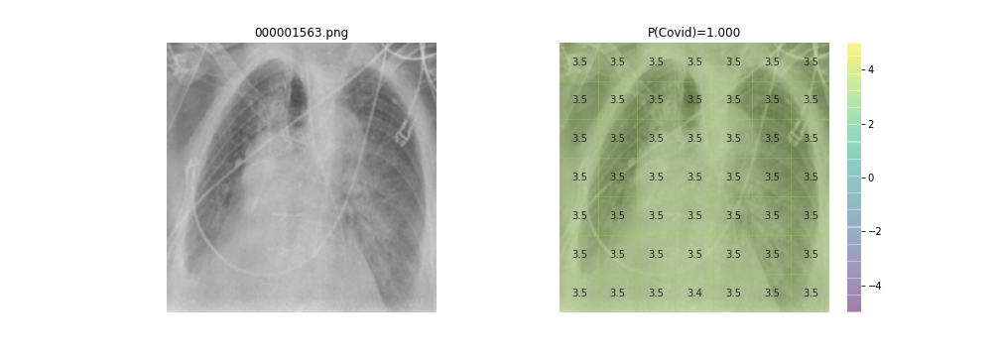

# CheXNet with Covid
We used an implementation of CheXNet by John Zech called [reproduce-chexnet](https://github.com/jrzech/reproduce-chexnet) and combined an aggregated COVID-19 Chest X-ray dataset from Kaggle. 

## Getting Started:
Click on the `launch binder` button at the top of this `README` to launch a remote instance in your browser using [binder](https://mybinder.org/). This requires no local configuration and lets you get started immediately. Open `Explore_Predictions.ipynb`, run all cells, and follow the instructions provided to review a selection of included [chest x-rays from NIH](https://arxiv.org/pdf/1705.02315.pdf).

This is a re-implementation of the original [CheXNet paper](https://arxiv.org/pdf/1711.05225) that predicted 14 common diagnoses, but modified
to include COVID-19. It uses over 100,000 images from the National Institutes of Health (NIH) and an aggregated dataset of chest x-rays from Kaggle.

## Dataset
The original CheXNet dataset uses chest x-rays from the National Institutes of Health (NIH). It contains roughly 112,000 chest x-ray images representing 14 different disease labels.
The full NIH dataset can be downloaded [here](https://nihcc.app.box.com/v/ChestXray-NIHCC). The files are compressed in `tar.gz` format and need to be extracted to an images folder.
  
The COVID-19 chest x-rays were from an aggregated Kaggle Dataset called [COVID-19 Radiography Database](https://www.kaggle.com/tawsifurrahman/covid19-radiography-database).

## Additional Notes
- **retrain.py**: Additional code was added so it runs reliably on Windows 10. The added loop in retrain.py needs to be removed if running on a different OS.  
- **pretrained_orig folder**: This is from the original reproduce-chexnet source code. It can be used to 
view the pretrained model and results prior to the addition of the Covid label and data.  

## Results:

<table border="0" class="dataframe">
  <thead>
    <tr style="text-align: right;">
      <th></th>
      <th>CheXNet AUC</th>
      <th>Retrained AUC</th>
      <th>AUC with Covid</th>
    </tr>
    <tr>
      <th>Labels</th>
      <th></th>
      <th></th>
      <th></th>
    </tr>
  </thead>
  <tbody>
    <tr>
      <th>Atelectasis</th>
      <td>0.8094</td>
      <td>0.8161</td>
      <td>0.8197</td>
    </tr>
    <tr>
      <th>Cardiomegaly</th>
      <td>0.9248</td>
      <td>0.9105</td>
      <td>0.9030</td>
    </tr>
    <tr>
      <th>Consolidation</th>
      <td>0.7901</td>
      <td>0.8008</td>
      <td>0.8084</td>
    </tr>
    <tr>
      <th>Covid</th>
      <td></td>
      <td></td>
      <td>0.9999</td>
    </tr>
    <tr>
      <th>Edema</th>
      <td>0.8878</td>
      <td>0.8979</td>
      <td>0.8991</td>
    </tr>
    <tr>
      <th>Effusion</th>
      <td>0.8638</td>
      <td>0.8839</td>
      <td>0.8857</td>
    </tr>
    <tr>
      <th>Emphysema</th>
      <td>0.9371</td>
      <td>0.9227</td>
      <td>0.9185</td>
    </tr>
    <tr>
      <th>Fibrosis</th>
      <td>0.8047</td>
      <td>0.8293</td>
      <td>0.8299</td>
    </tr>
    <tr>
      <th>Hernia</th>
      <td>0.9164</td>
      <td>0.9010</td>
      <td>0.8877</td>
    </tr>
    <tr>
      <th>Infiltration</th>
      <td>0.7345</td>
      <td>0.7077</td>
      <td>0.7248</td>
    </tr>
    <tr>
      <th>Mass</th>
      <td>0.8676</td>
      <td>0.8308</td>
      <td>0.8285</td>
    </tr>
    <tr>
      <th>Nodule</th>
      <td>0.7802</td>
      <td>0.7748</td>
      <td>0.7694</td>
    </tr>
    <tr>
      <th>Pleural_Thickening</th>
      <td>0.8062</td>
      <td>0.7860</td>
      <td>0.7947</td>
    </tr>
    <tr>
      <th>Pneumonia</th>
      <td>0.7680</td>
      <td>0.7651</td>
      <td>0.7693</td>
    </tr>
    <tr>
      <th>Pneumothorax</th>
      <td>0.8887</td>
      <td>0.8739</td>
      <td>0.8777</td>
    </tr>
  </tbody>
</table>

## Results available in pretrained folder:
- `aucs.csv`: test AUCs of retrained model (including COVID-19 label) vs original ChexNet reported results
- `checkpoint`: saved model checkpoint
- `log_train`: log of train and val loss by epoch
- `preds.csv`: individual probabilities for each finding in each test set image predicted by retrained model

## Train your own model!
Please note: a GPU is required to train the model. You will encounter errors if you do not have a GPU available and CUDA installed and you attempt to retrain. With a GPU, you can retrain the model with `retrain.py`. Make sure you download both required datasets before trying this. If you run out of GPU memory, reduce `BATCH_SIZE` from its default setting of 32.

If you do not have a GPU, but wish to retrain and verify the results, you can set up a cloud instance with a dedicated GPU using AWS or Google Cloud. The price depending on your chosen environment and GPU will be around 1-3 USD per hour. 

A sample of 621 test NIH chest x-rays enriched for positive pathology is included with the repo to faciliate immediate use and exploration in the `Explore Predictions.ipynb` notebook. The [full NIH dataset](https://nihcc.app.box.com/v/ChestXray-NIHCC) and 
the [COVID-19 Radiography Database](https://www.kaggle.com/tawsifurrahman/covid19-radiography-database) are required for model retraining.

## Acknowledgements
We would like to acknowledge John Zech for his implementation of CheXNet, which was the basis of our entire project.  
His original implementation can be found [here](https://github.com/jrzech/reproduce-chexnet).
